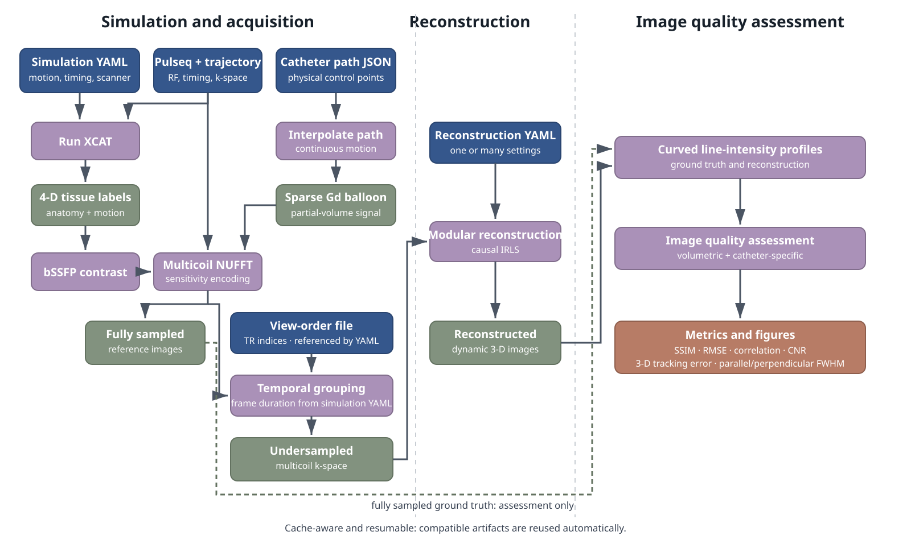
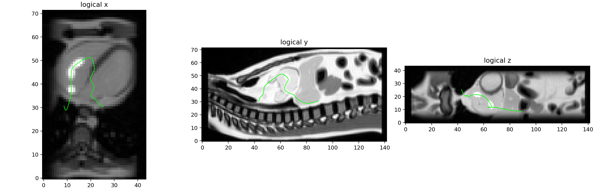
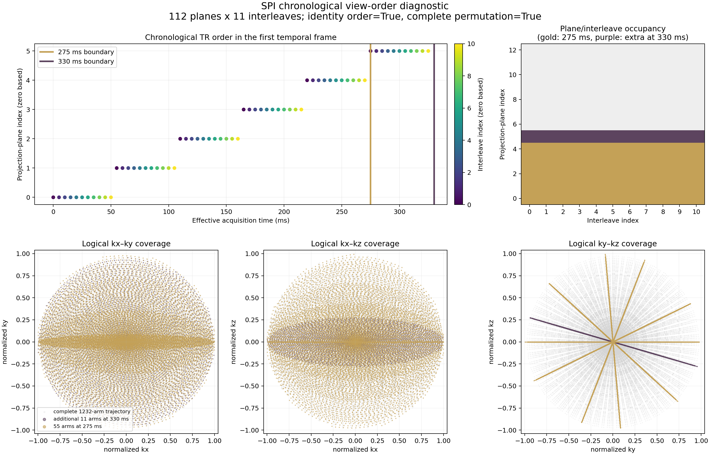
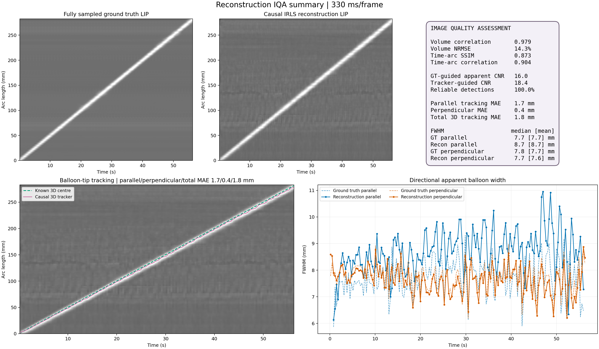

# XCAT-iCMR

XCAT-iCMR is a cache-aware Python toolbox for simulating dynamic 3-D
interventional cardiovascular MRI. It combines XCAT anatomy and motion, a
Pulseq sequence and non-Cartesian trajectory, multicoil sensitivity encoding,
and a moving Gd-filled catheter balloon. The resulting data can be
undersampled, reconstructed, and assessed against a matching fully sampled
reference.



## What it provides

- Dynamic `uint16` XCAT tissue labels and bSSFP tissue contrast.
- Sparse, partial-volume Gd-balloon motion along user-provided control points.
- GPU or CPU 3-D SigPy NUFFT encoding with multicoil sensitivity maps.
- Fully sampled references and view-order-driven undersampled k-space.
- Modular causal-IRLS reconstruction with parameter sweeps.
- Volumetric and catheter-specific image quality assessment.

## Requirements

- Python 3.10 or newer.
- The XCAT executable and license.
- Pulseq sequence/trajectory metadata, DCF, and coil sensitivity maps referenced
  by the simulation configuration.
- An NVIDIA GPU and working driver for the recommended GPU workflow; CPU
  execution is supported for development and small tests.

## Install

CPU:

```bash
python -m venv .venv
source .venv/bin/activate
python -m pip install -e ".[dev]"
```

CUDA 12 GPU:

```bash
python -m venv .venv
source .venv/bin/activate
python -m pip install --upgrade pip
python -m pip install -e ".[dev,gpu]"
nvidia-smi
```

Set `compute.device_id: -1` for CPU or `0`, `1`, … for a visible GPU. See
[GPU setup](docs/gpu-setup.md) for environment and troubleshooting notes.

## Quick start

Create user-owned configurations from the supplied examples:

```bash
cp configs/simulation.template.yaml configs/my_simulation.yaml
cp configs/recon_sweep.example.yaml configs/my_recon.yaml
```

Edit the input paths and experiment settings, then run the three stages:

```bash
xcat-icmr simulate configs/my_simulation.yaml
xcat-icmr reconstruct configs/my_recon.yaml
xcat-icmr assess-image-quality configs/my_recon.yaml
```

`simulate` validates the configuration, resolves dependencies, reuses
compatible cached artifacts, and generates only missing stages. Preview its
resolved work without generating data:

```bash
xcat-icmr simulate configs/my_simulation.yaml --dry-run
```

The reconstruction configuration can select several acquisitions and several
hyperparameter settings. Each reconstruction recipe is applied to each
selected acquisition; existing completed jobs are reused. The assessment
command resolves the same jobs automatically—users do not need to locate cache
IDs or long reconstruction paths.

## Main outputs

| Stage | Primary output |
|---|---|
| Simulation | Fully sampled tissue-plus-Gd reference and undersampled multicoil k-space |
| Reconstruction | Complex dynamic 3-D image and reconstruction metadata |
| Assessment | `metrics.json`, `summary_line_profiles.png`, and `curved_profile_comparison.png` |

Numerical arrays use single precision: real contrast is `float32`, labels are
`uint16`, and complex images/k-space are `complex64`.

## Example stages

<table>
  <tr>
    <td width="50%"></td>
    <td width="50%"></td>
  </tr>
  <tr>
    <td align="center"><b>Anatomy and catheter path</b></td>
    <td align="center"><b>Trajectory and temporal sampling</b></td>
  </tr>
</table>



The image quality assessment includes volume correlation and NRMSE,
time–arc-length SSIM and correlation, ground-truth- and tracker-guided apparent
CNR, causal 3-D tracking error, and parallel/perpendicular FWHM.

## Reuse and reproducibility

Expensive artifacts are content-addressed under `outputs/cache`. Identities are
derived from the numerical inputs that affect each stage, so compatible labels,
tissue encoding, and acquisitions are reused while changed inputs receive new
cache entries. Generated acquisition HDF5 files carry their trajectory, DCF,
coil maps, timing, orientation, sequence signature, and simulation provenance.

See [Caching and outputs](docs/caching.md) for the dependency levels and storage
layout.

## Documentation

- [Pipeline and data products](docs/pipeline.md)
- [Simulation and reconstruction configuration](docs/configuration.md)
- [Caching and outputs](docs/caching.md)
- [GPU setup](docs/gpu-setup.md)
- [Advanced command-line interface](docs/advanced-cli.md)

The shipped templates are [simulation.template.yaml](configs/simulation.template.yaml),
[recon_config.template.yaml](configs/recon_config.template.yaml), and
[recon_sweep.example.yaml](configs/recon_sweep.example.yaml).
